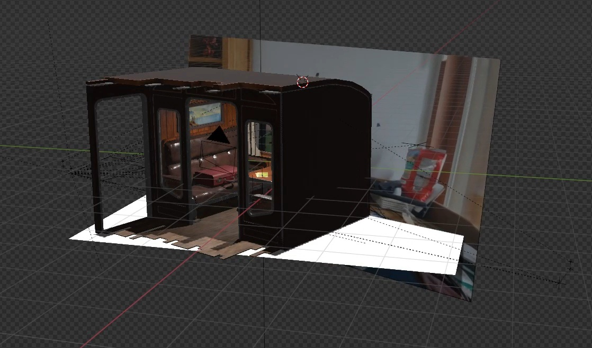

<div align="center">

# 🚂 Tramscape to Korea

  

> *"Lean into the window and explore Korea!" "창문에 몸을 기울여 한국을 여행해요! 🚃🏘️"*  
> *Your body becomes the camera. Move, and the scenery follows. 몸이 카메라가 됩니다. 움직이면 풍경이 따라와요.*

</div>

🚃 Tramscape to Korea is an **immersive train travel game that turns your body into a window to Korea**. Lean left and the tiled rooftops of Gyeongju Hanok Village unfold before you; step closer and the elegant eaves reach out to greet you. No headset, no controller—just you and the window. Real-time body tracking transforms your natural movements into cinematic motion parallax, making a flat screen feel like a real train window to Korea's beautiful landmarks.

<br>

🚃 Tramscape to Korea는 **당신의 몸을 한국의 관광 명소로 통하는 창문으로 만드는 실감형 기차 여행 게임**입니다. 왼쪽으로 기울이면 경주 한옥마을의 기와지붕이 펼쳐지고, 앞으로 다가서면 고즈넉한 처마 끝이 눈앞으로 다가옵니다. 헤드셋도, 컨트롤러도 필요 없이 오직 당신과 창문만으로. 실시간 바디 트래킹이 자연스러운 움직임을 시네마틱한 운동 시차로 바꿔, 평면 화면을 한국의 아름다운 랜드마크로 향하는 진짜 기차 창문처럼 느끼게 해줍니다.

---

<div align="center">

## 📋 Table of Contents

1. [🎯 Overview](#-overview)
2. [🎬 Concept](#-concept)
3. [⚙️ Core System](#️-core-system)
4. [🎮 Gameplay](#-gameplay)
5. [🏆 Exhibition & Award](#-exhibition--award)

---

</div>

<div align="center">
  
## 🎯 Overview

### 📖 Introduce

**Name**: Tramscape to Korea  
**Genre**: Immersive Simulation / Virtual Tourism  
**Platform**: PC (Large Display + Azure Kinect)  
**Duration**: 2024.03 ~ 2024.09  

   
    |    |   

<br>

### 👥 Team

| Position | Role | Name | University & Major |
|:--|:--|:--|:--|
| 🎨 Art | 3D Artist | Patricia Joan | Kyung Hee Univ.<br>Hotel Management |
| 💻 Dev | PM & Interaction Design | [Jaehyun Byun](https://github.com/BynPlay) | Kyung Hee Univ.<br>Computer Science |
| 💻 Dev | Game Client Developer | [Byunghoon Kang](https://github.com/dot-mario) | Kyung Hee Univ.<br>Software Convergence |
| 💻 Dev | Gameplay Programmer | [Minsu Kim](https://github.com/Nephrite21) | Kyung Hee Univ.<br>Software Convergence |
| 💻 Dev | Graphics Technical Artist | [Yonghyun Kwon](https://github.com/Noperi0r) | Kyung Hee Univ.<br>Software Convergence |

</div>

---

<br>

## 🎬 Concept

<br>

<div align="center">

### 🪟 The "Window" Metaphor

<div align="center">
  
</div>

<br> 

Flat screens lack depth. Windows don't. Move your body, and the world beyond feels real. We turned this into gameplay.  

평면 화면엔 깊이가 없지만 창문엔 있습니다. **몸을 움직이면, 너머가 살아나는 단순한 메타포**를 게임으로 구현했습니다.

| Design Pillar | Description |
|:--|:--|
| **No Wearables** | Pure body-driven interaction—stand and move freely<br>순수한 신체 기반 인터랙션—서서 자유롭게 움직이기 |
| **Natural Discovery** | Lean to reveal, step closer to immerse<br>기울여서 발견하고, 다가서서 몰입하기 |
| **Cinematic Journey** | Train travel narrative with AI tour guide<br>AI 관광 가이드와 함께하는 기차 여행 서사 |

</div>

<br>

---

## ⚙️ Core System

<div align="center">
  
</div>

<br>

### 🎯 Body Tracking → Motion Parallax Pipeline
```
[Azure Kinect] → Eye Position (3D) → Noise Filter → Screen-Space Transform → Camera Frustum Adjust → Render
```

| Module | Function |
|:--|:--|
| **Eye Tracker** | Azure Kinect SDK extracts closest user's eye midpoint as 3D vector<br>Azure Kinect SDK로 가장 가까운 사용자의 눈 중심점을 3D 벡터로 추출 |
| **Noise Filter** | Average / Exponential filter removes jitter for stable visuals<br>Average / Exponential 필터로 떨림 제거, 안정적인 화면 제공 |
| **Frustum Adjuster** | Transforms eye position to screen-space, dynamically shifts camera frustum<br>눈 위치를 화면 공간으로 변환, 카메라 절두체 동적 조정 |
| **Dual Camera Render** | Two cameras composite final parallax output in LateUpdate()<br>두 대의 카메라가 LateUpdate()에서 최종 패럴랙스 출력 합성 |
> 🔗 **Technical Details**: [Our MotionParallax Repository](https://github.com/Noperi0r/BodyTrackingProject_3DParallax)
<br>

### 🚂 Train Ride System

| Feature | Implementation |
|:--|:--|
| **Path** | Unity Spline-based track with smooth curves through landmarks<br>랜드마크를 지나는 부드러운 곡선의 Unity Spline 기반 트랙 |
| **Motion Feel** | Subtle vibration simulating real train movement<br>실제 기차 움직임을 시뮬레이션하는 미세한 진동 |
| **Tour Guide** | AI-generated announcements triggered at key scenic points<br>주요 명소 지점에서 트리거되는 AI 생성 안내 방송 |

<br>

---

## 🎮 Gameplay

> ⚠️ Requires **Azure Kinect DK** + Large Display (recommended 50"+)
### 🗺️ Scenes

<div align="center">

| | 🏘️ **Gyeongju Hanok Village** | 🌉 **Woljeong Bridge** |
|:--:|:--|:--|
| |  |  |
| **Time** | ☀️ Day | 🌙 Night |
| **Mood** | Warm sunlight over tiled rooftops<br>기와지붕 위로 쏟아지는 따스한 햇살 | Lanterns glowing on ancient waters<br>고요한 물 위에 빛나는 등불 |
| **Discovery** | Hidden alley details, wooden textures<br>숨겨진 골목 디테일, 나무 질감 | Lantern reflections, bridge structure<br>등불 반사, 다리 구조물 |
| **Audio** | Daytime ambience + tour guide<br>낮 시간 앰비언스 + 관광 가이드 | Night crickets + tour guide<br>밤 귀뚜라미 + 관광 가이드 |

</div>

<br>

### 🎨 Art & Environment

| Element | Details |
|:--|:--|
| **Modeling** | Hand-crafted in Blender—Hanok village streets, traditional architecture, Woljeong Bridge<br>Blender로 직접 제작—한옥마을 골목, 전통 건축, 월정교 |
| **Rendering** | Unity HDRP with custom post-processing for photorealistic quality<br>실사 품질을 위한 커스텀 포스트 프로세싱 적용 Unity HDRP |
| **Lighting** | Dynamic day/night scenarios—soft daylight vs warm lantern glow<br>동적 낮/밤 시나리오—부드러운 낮빛 vs 따뜻한 등불 |
| **Audio** | AI-generated Korean tour narration synced to scenic moments<br>명소 순간에 맞춰 재생되는 AI 생성 한국어 관광 안내 |

<br>

---

## 🏆 Exhibition & Award

### 📍 Tourism Job Festa @ Gangnam AT Center

**2 Days | September 2024 | Public Exhibition**

Visitors young and old experienced the window metaphor firsthand. Tourism industry experts provided iterative feedback throughout development—refining interaction timing, guide narration pacing, and visual polish for maximum "wow factor" at the booth.

강남 AT 센터 관광일자리페스타에 다양한 관람객이 창문 메타포를 직접 체험했습니다. 개발 전 과정에서 관광 업계 전문가 피드백을 반영—인터랙션 타이밍, 안내 멘트 페이싱, 부스 현장 "와우 팩터"를 위한 비주얼 폴리싱을 거듭했습니다.

<br>

### 🥇 Grand Prize — Korea Tourism Organization Director's Award

**2024 Immersive Tourism Content Competition**  
Hosted by Korea Tourism Organization (한국관광공사)

Recognized for:
- ✅ **Interaction Innovation** — Body-driven parallax without wearables  
- ✅ **Technical Excellence** — Real-time tracking + HDRP rendering pipeline  
- ✅ **Tourism Value** — Practical solution for destination marketing  

인터랙션 혁신(착용 장비 없는 신체 기반 패럴랙스), 기술적 완성도(실시간 트래킹 + HDRP 렌더링 파이프라인), 관광 산업 가치(목적지 마케팅을 위한 실용적 솔루션)를 인정받아 최우수상 수상.
